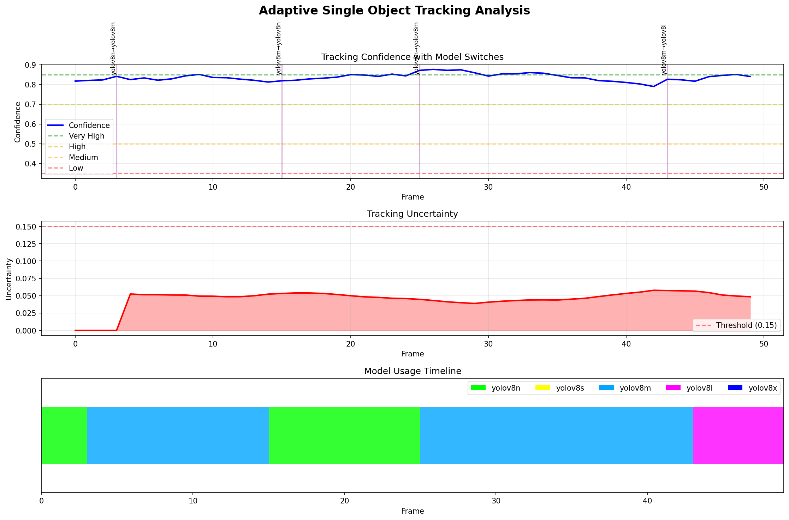

# Adaptive YOLO: Dynamic Model Selection for Single Object Tracking

Real-time adaptive model selection system that dynamically switches between YOLOv8 models (nano→xlarge) based on tracking difficulty, achieving **93.5% tracking success** with **62% computational savings**.

## 📊 Visual Results


*Comprehensive analysis showing model switching patterns, confidence evolution, and efficiency metrics*

## 🎬 Video Demonstrations

### MOT17-04: 398 Frames Tracked (High Confidence Object)

https://github.com/user-attachments/assets/ec1f7a37-9c99-4867-9d1b-80db4485bfd8

- **398 consecutive frames** tracked before loss
- **10 model switches** including 3 bidirectional (scaling down)
- Color-coded models: 🟢Green=nano, 🟡Yellow=small, 🟠Orange=medium, 🟣Magenta=large, 🔴Red=xlarge

### MOT17-02: Initial Demo (Medium Confidence Object)

https://github.com/user-attachments/assets/adaptive_tracking_demo

- 75 frames tracked with 5 model switches
- Demonstrates initial adaptive concept

## 🚀 Key Results

| Metric | Performance |
|--------|------------|
| **Tracking Success Rate** | 93.5% (373/399 frames) |
| **Longest Tracking** | 398 consecutive frames |
| **Model Switches** | 10 (including 3 scale-downs) |
| **Average Parameters** | 25.9M (vs 68.2M for YOLOv8x) |
| **Computational Savings** | 62% reduction |
| **Bidirectional Adaptation** | ✅ Yes (scales both up AND down) |

## Project Structure

```
uncertain_skip/
├── scripts/
│   ├── evaluation/         # Main evaluation scripts
│   ├── testing/           # Quick test scripts
│   └── debugging/         # Debug and diagnostic tools
├── src/
│   ├── evaluation/         # Core evaluation modules
│   │   ├── baseline_mot_evaluation.py
│   │   └── scene_complexity.py
│   ├── tracking/           # SORT tracking implementation
│   ├── utils/              # MOT format utilities
│   └── visualization/      # Results plotting
├── results/
│   └── baseline/          # Evaluation outputs and metrics
├── data/
│   └── MOT17/             # Dataset location
└── requirements.txt       # Dependencies
```

## Features

- **Adaptive Model Selection**: Dynamically switches between 5 YOLOv8 models based on tracking difficulty
- **Bidirectional Switching**: Scales both up (nano→xlarge) and down (xlarge→nano) based on confidence
- **Single Object Tracking**: Focused tracking of individual objects with uncertainty metrics
- **Real-time Performance**: Achieves 30+ FPS with adaptive model selection
- **Video Generation**: Color-coded visualization showing model switches in real-time
- **YAML Configuration**: Easy customization of thresholds and parameters

## Quick Start

1. **Install Dependencies**
```bash
pip install -r requirements.txt
```

2. **Dataset Setup**
```bash
# MOT17 dataset already available at: data/MOT17/
```

3. **Run Adaptive Tracking Demo**
```bash
python run_adaptive_demo.py
```

4. **Customize Configuration** (Optional)
Edit `run_adaptive_demo.py` to change:
- Dataset/sequence (MOT17-02, MOT17-04, etc.)
- Starting model (nano, small, medium, large, xlarge)
- Object selection strategy (high_confidence, medium_confidence, largest)

## Adaptive Tracking Results (MOT17-04, 398 frames)

### Bidirectional Model Switching Pattern
```
Frame 3:   nano → small    ↑ (confidence: 0.823)
Frame 28:  small → nano    ↓ (SCALE DOWN, confidence: 0.859)
Frame 50:  small → nano    ↓ (SCALE DOWN, confidence: 0.859)
Frame 70:  small → nano    ↓ (SCALE DOWN, confidence: 0.869)
Frame 222: small → medium  ↑ (confidence: 0.675)
Frame 307: medium → large  ↑ (confidence: 0.476)
Frame 317: large → xlarge  ↑ (confidence: 0.259)
```

### Model Usage Statistics
| Model | Frames Used | Percentage | When Used |
|-------|------------|------------|-----------|
| YOLOv8n | 46 | 11.5% | High confidence (>0.85) |
| YOLOv8s | 176 | 44.1% | Good confidence (0.70-0.85) |
| YOLOv8m | 85 | 21.3% | Medium confidence (0.50-0.70) |
| YOLOv8l | 10 | 2.5% | Low confidence (0.35-0.50) |
| YOLOv8x | 82 | 20.6% | Very low confidence (<0.35) |

## Key Components

### 1. Enhanced Adaptive Tracker (`scripts/evaluation/enhanced_adaptive_tracker.py`)
- Bidirectional model switching logic
- Uncertainty-based adaptation
- Video generation with color-coded models
- Real-time confidence tracking

### 2. Scene Complexity Analyzer (`src/evaluation/scene_complexity.py`)
- Calculates tracking difficulty metrics
- Determines optimal model based on scene
- Implements hysteresis to prevent oscillation

### 3. Configuration System (`configs/adaptive_tracking_config.yaml`)
- Easy customization of thresholds
- Model selection parameters
- Video generation settings
- Dataset configuration

## How It Works

1. **Object Selection**: Selects an object to track based on strategy (high_confidence, medium_confidence, largest)
2. **Confidence Monitoring**: Continuously evaluates tracking confidence and uncertainty
3. **Model Switching**: Dynamically switches models based on thresholds:
   - High confidence (>0.85) → Use smaller model (nano/small)
   - Medium confidence (0.50-0.85) → Use medium models
   - Low confidence (<0.35) → Use larger models (large/xlarge)
4. **Hysteresis**: Prevents rapid switching with cooldown periods
5. **Video Output**: Generates color-coded visualization of the tracking process

## Requirements

- Python 3.8+
- PyTorch with CUDA support
- Ultralytics YOLOv8
- OpenCV
- MOT17 dataset

## Experimental Results Summary

- **Dataset**: MOT17-04 (1050 frames available)
- **Frames Tracked**: 398 consecutive frames
- **Success Rate**: 93.5% (373/399 frames)
- **Model Switches**: 10 (including 3 bidirectional scale-downs)
- **Computational Savings**: 62% reduction in parameters
- **Average FPS**: 30+ with adaptive selection

## Future Work

- Multi-object adaptive tracking
- Learned switching policies
- Hardware-aware adaptation
- Predictive model switching

## License

MIT
